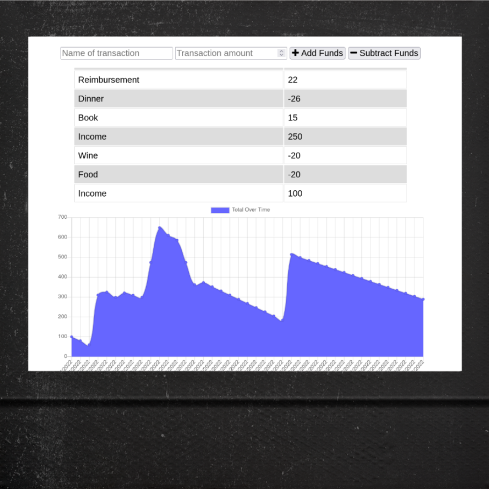

# Budget Tracker

An app that tracks expenses. Designed for offline functionality. 

## Description
Enter a name and amount to change your total. Negative numbers are not necessary - use the 'Subtract Funds' button for expenses.
When you add or remove funds, your new total is displayed at the top and your history is updated in the table and graph below.  
If you enter changes with poor or no internet connection, your updates will be saved via IndexedDB and added when a connection is reestablished.

## Screenshot 

## Technologies
This app uses a MongoDB database, and the Mongoose object modeling tool. IndexedDB is used to achieve offline functionality. 

## Live Site
A demo version of this application is deployed to [Heroku](https://budget-tracker-c19.herokuapp.com/).